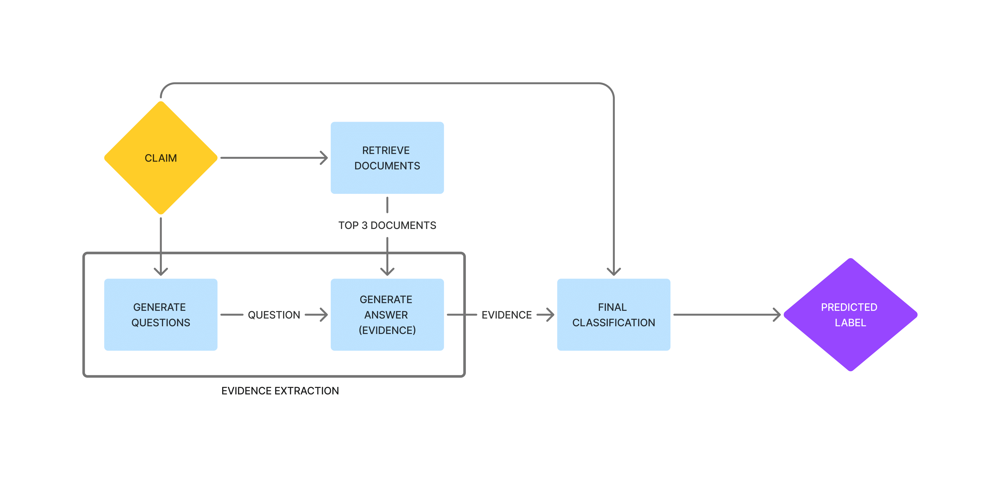

# Evidence-backed Fact Checking using RAG and Few-Shot In-Context Learning with LLMs
Official code for our [paper](https://arxiv.org/pdf/2408.12060) accepted at the FEVER workshop at EMNLP 2024.

If you find this useful, please cite our paper: 

    @inproceedings{singhal-2024-evidence-backed-fact-checking,
    title = {Evidence-backed Fact Checking using RAG and Few-Shot In-Context Learning with LLMs},
    author = {Ronit Singhal and Pransh Patwa and Parth Patwa and Aman Chadha and Amitava Das}
    booktitle = {Proceedings of the Seventh Workshop on Fact Extraction and VERification (FEVER)},
    year = {2024},
    publisher = {Association for Computational Linguistics},
   }
